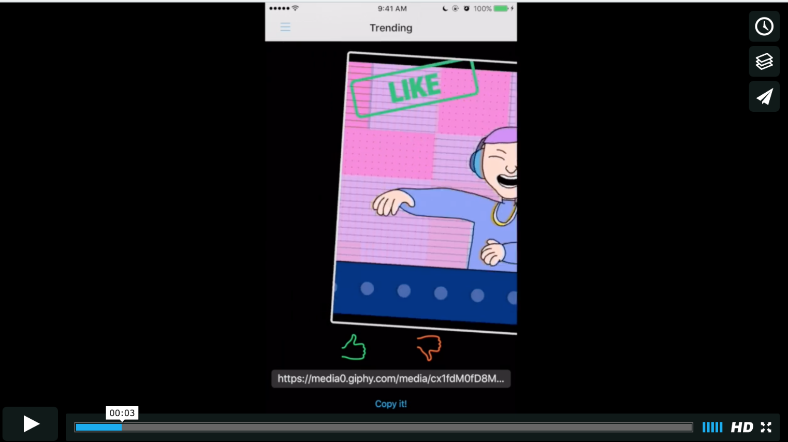

#Liked - Tinder With Giphy

Quick Demo

#What is it?
Liked is an iOS application that brings the tinder experience to Giphy images. This app integrates the Giphy API to fetch fresh images in Trending, Random, Search, and Translation categories. While viewing each Giphy image, user can either 'Like' or 'Nope' an image. Liked images will be saved in a collection for future revisits.  

#Why did I built this?
+ For a good laugh. Who doesn't like to explore Giphy images and be surprised by what you can find?
+ Level up on API usage, Model, View + Container View, Controller and Object Oriented Design
+ Let go of the storyboard / XIBs, focus more on code 
+ Make a pretty app (prettificaiton in progress = D)

#ACKNOWLEDGEMENT:
Some of the features in this product is using third party frameworks listed below: 
MDCSwipeToChoose
MMDrawerController
MBProgressHUD
AFNetworking
Realm
YYWebImage
Masonry
FontAwesomeKit
ChameleonFramework

